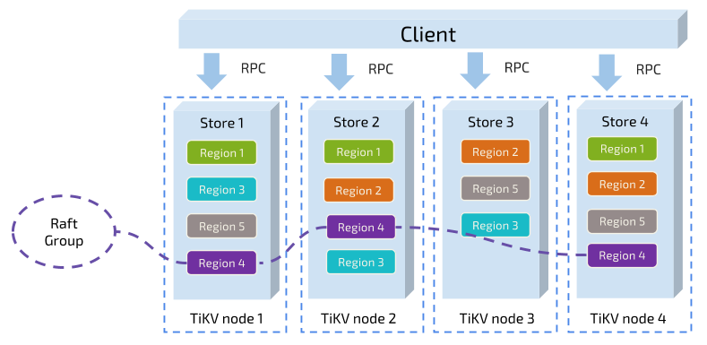

# 项目整体架构
该文档主要参考[三篇文章了解 TiDB 技术内幕 - 说存储](https://cn.pingcap.com/blog/tidb-internal-1)与[三篇文章了解 TiDB 技术内幕 - 谈调度](https://cn.pingcap.com/blog/tidb-internal-3)，结合了自己对Tinykv项目的理解。

## 需求分析——从保存数据说起
一说到保存数据，我们能想到最简单的方法就是在内存中建立数据结构，然后向其中增删数据。这是一个简单且高效的方法，但缺点确实不可持久化，一旦断电数据便消失。于是我们可以考虑将数据保存到硬盘这样的非易失性存储介质中，这样可能会牺牲一些效率，但却能为我们真正保存数据。但如果磁盘出现了坏道呢，我们可以考虑进行数据冗余存储与网络存储。但问题却是一个接一个的来，包括但不限于以下问题：
* 能否支持跨数据中心的容灾？
* 写入速度是否够快？
* 数据保存下来后，是否方便读取？
* 保存的数据如何修改？如何支持并发的修改？
* 如何原子地修改多条记录？

事实上要做一个优秀的数据存储系统，这些问题都是不可避免的。我们将通过对TinyKv学习，掌握实现一个水平可扩展、高可用、支持分布式事务的键值存储服务的知识。同时也能对TiKv的架构和实现有更好的理解。

## Key-Value
作为数据存储系统，我们首先要决定的就是数据的存储模型，即数据以什么形式保存下来。对此TinyKv的选择是Key-Value模型，简单而言可以将整个TinyKv当作一个巨大的Map，对此我们需要记住以下两点：
* 这是一个巨大的 Map，也就是存储的是 Key-Value pair
* 这个 Map 中的 Key-Value pair 按照 Key 的二进制顺序有序，也就是我们可以 Seek 到某一个 Key 的位置，然后不断的调用 Next 方法以递增的顺序获取比这个 Key 大的 Key-Value
  
我们所作的一切工作都是维护这样一个巨大Map，让其能高效进行数据的读写。

## BadgerDB
数据最终是要存储到磁盘上的，但TinyKv没有选择直接进行磁盘的读写，而是使用BadgerDB。BadgerDB是一个单机存储引擎，可以简单将其看成是一个单机的Key-Value Map。TinyKv将需要存储到磁盘中的数据保存到BadgerDB，由BadgerDB负责具体的数据落盘。

我们将在project1中体会如何在BadgerDB上实现一个单机存储引擎，即StandAloneStorage。同时我们还会实现一个简单的server接口，用于实现对底层数据的读写。

## Raft
现在我们已经有了本地存储的方案，但为了实现数据的多副本存储，我们还需要想办法将数据复制到多台机器上，并要保证该复制方案是可靠、高效的。Raft协议就是这样的解决方法。Raft是一个一致性算法，它负责让数据保存在多个机器上，具体内容可见[Raft论文中文翻译](https://github.com/maemual/raft-zh_cn/blob/master/raft-zh_cn.md)。

我们将在project2A中实现Raft层的消息收发，向下实现内存中的日志复制，向上提供Raft层的各种接口。随后我们会在project2B中实现日志通过Raft协议在多台机器上同步后，进行日志在多台机器上的落盘与应用。并在project2C中实现日志的压缩与快照处理。

自此我们就实现了一个分布式KV存储系统，但还不够，正如Project3文档所说：
>在 Project2 中，你建立了一个基于Raft的高可用的kv服务器，做得很好！但还不够，这样的kv服务器是由单一的 raft 组支持的，不能无限扩展，并且每一个写请求都要等到提交后再逐一写入 badger，这是保证一致性的一个关键要求，但也扼杀了任何并发性。

接下来我们将会实现kv服务器的扩展，并真正实现并发性。

## Region
Region是TinyKv中一个非常重要的概念。前面提到TinyKv是一个巨大的Map，我们就通过Region将这个KV进行划分，以\[StartKey,EndKey)的方式划分每个Region的范围。接下来我们会做两件重要的事情：
* 以 Region 为单位，将数据分散在集群中所有的节点上，并且尽量保证每个节点上服务的 Region 数量差不多
* 以 Region 为单位做 Raft 的复制和成员管理

对于第一点，TinyKv会利用Scheduler来负责将 Region 尽可能均匀的散布在集群中所有的节点上，这样一方面实现了存储容量的水平扩展（增加新的结点后，会自动将其他节点上的 Region 调度过来），另一方面也实现了负载均衡（不会出现某个节点有很多数据，其他节点上没什么数据的情况）。

对于第二点，实际上就是Raft协议的具体实现，所有的读写都通过Leader进行，再有Leader复制给Follower。

## 调度
### 调度操作
为了实现Region的调度，我们首先需要实现调度的基本操作，整理一下就是以下三件事：
* 增加一个 Replica（副本）
* 删除一个 Replica
* 将 Leader 角色在一个 Raft Group 的不同 Replica 之间 transfer

我们在project3A中实现了Raft层的Add/Remove Peer与Transfer Leader，随后在project3B中实现了对三种调度命令的处理。

### 调度需求
调度需求依赖于对整个集群信息的收集，我们需要知道TinyKv每个RaftStore的状态和每个Region的状态。在project3C中，我们实现了对Region信息的收集处理。

每个 Raft Group 的 Leader 和 PD 之间存在心跳包，用于汇报这个 Region 的状态 ，主要包括下面几点信息：
* Leader 的位置
* Followers 的位置
* 掉线 Replica 的个数
* Region大小

### 调度策略
针对Region的调度策略有很多，像是Balance-Region和Balance-Leader，在project3C中我们会实现Balance-Region。用于避免在一个 store 里有太多的 region。

## MVCC与事务
在project4中，我们将实现多版本控制（MVCC），以及一个事务系统，用于处理多个客户端的需求，