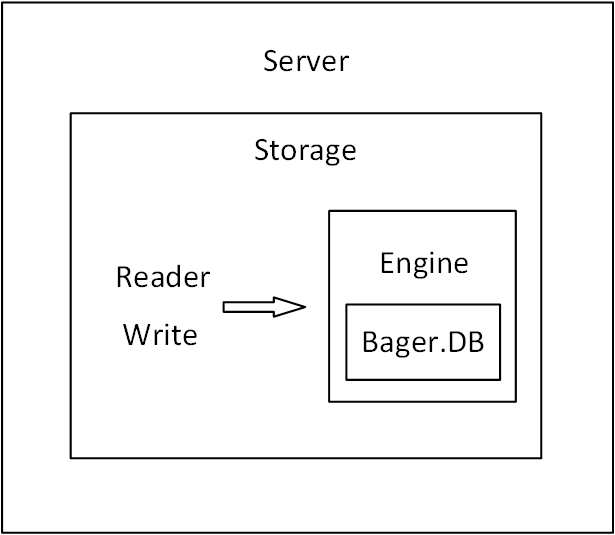

# Project1
本节需要我们实现两个目标：
* 实现一个独立的存储引擎
* 实现原始的 `key/value` 服务处理程序
  
针对这两个问题，我们首先看一张图：



通过这张图我们可以知道本节需要实现的独立的存储引擎实际上就是`Engine`的一个`storage`接口，并增加对Engine的`Reader、Write、Start、Stop`。这一点也可以从代码中得出：
```GO
type Storage interface {
	Start() error
	Stop() error
	Write(ctx *kvrpcpb.Context, batch []Modify) error
	Reader(ctx *kvrpcpb.Context) (StorageReader, error)
}
```

接着我们需要依赖这个`storage`接口实现`server`的原始`key/value`服务，包括 `RawGet / RawScan / RawPut / RawDelete`。

## Project1a
> Implement a standalone storage engine.

### StandAloneStorage定义与创建
本节需要完善的代码在`kv/storage/standalone_storage/standalone_storage.go`。首先我们需要定义`StandAloneStorage`的结构以及创建函数。根据上图分析，该`storage`结构需要包含一个`engine`字段，因而可以进行如下的定义：

```GO
type StandAloneStorage struct {
	// Your Data Here (1).
	engines *engine_util.Engines
	config  *config.Config
}
```

新建函数`NewStandAloneStorage`需要根据`config.Config`创建一个`StandAloneStorage`，主要就是对`Engines`的创建，只需要根据`Engines`的创建函数填入相应参数即可。

### Write
该函数定义为 `func (s *StandAloneStorage) Write(ctx *kvrpcpb.Context, batch []storage.Modify) error`，我们需要根据`batch`中的变更类型对`engine`进行写入操作（`Put`和`Delete`）。这里我们可以使用`WriteBatch`的`SetCF`与`DeleteCF`函数设置好写入操作，随后调用`WriteBatch`中的`WriteToDB`函数即可实现写入存储的操作。

### Reader
Reader函数定义为`func (s *StandAloneStorage) Reader(ctx *kvrpcpb.Context) (storage.StorageReader, error)` 需要我们返回一个`StorageReader`的接口，该接口定义如下：

```GO
type StorageReader interface {
	// When the key doesn't exist, return nil for the value
	GetCF(cf string, key []byte) ([]byte, error)
	IterCF(cf string) engine_util.DBIterator
	Close()
}
```

我们需要根据该接口定义一个`StandAloneStorageReader`的结构体，并实现该接口需要的相应函数。根据文档提示，我们需要使用 `badger.Txn` 来实现 `Reader` 函数，因为 badger 提供的事务处理程序可以提供 keys 和 values 的一致快照。则该结构体定义如下：

```GO
type StandAloneStorageReader struct {
	txn *badger.Txn
}
```

相应函数均可使用badger.Txn实现。

## Project1b
> Implement service handlers

本节需要实现的四个函数都比较简单，简单提一下实现方法：
* RawGet：利用storage的Reader与GetCF获取对应CF和Key的value。
* RawPut：利用Modify与storage的Write函数进行写入操作。
* RawDelete：与RawPut操作相同。
* RawScan：利用storage的Reader与IterCF获取迭代器。根据StartKey进行Seek后，提取Key与Value。

## 碎碎念
这一节不涉及分布式存储，更多是一个熟悉GO语法以及熟悉整体架构的练手project。

