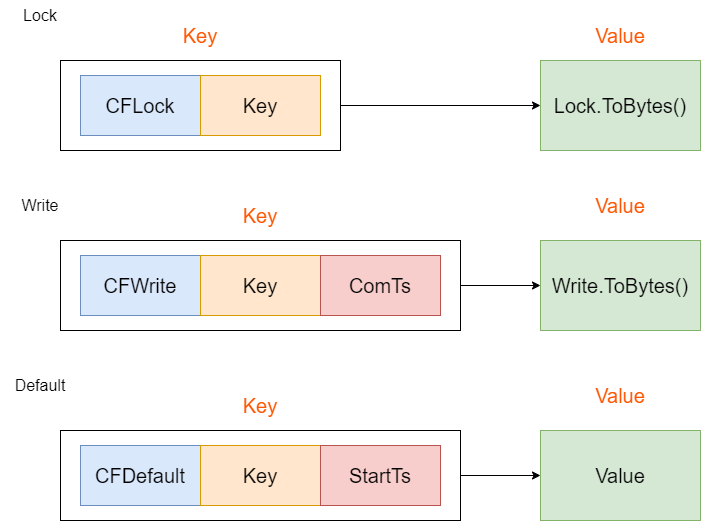

- [Project4](#project4)
  - [2PC](#2pc)
  - [Project4A](#project4a)
    - [GetValue](#getvalue)
    - [CurrentWrite](#currentwrite)
    - [MostRecentWrite](#mostrecentwrite)
  - [Project4B](#project4b)
    - [KvGet](#kvget)
    - [KvPrewrite](#kvprewrite)
    - [KvCommit](#kvcommit)
  - [Project4C](#project4c)
    - [KvScan](#kvscan)
    - [KvCheckTxnStatus](#kvchecktxnstatus)
    - [KvBatchRollback](#kvbatchrollback)
    - [KvResolveLock](#kvresolvelock)

# Project4
在之前的项目中，我们已经建立了一个 key/value 数据库，通过使用 Raft，该数据库在多个节点上是一致的。现在我们要建立一个事务系统，用于处理多个客户端请求，我们将在 Part A 实现 MVCC，在 Part B & Part C你将实现事务性API。

## 2PC
TinyKV的事务设计遵循 Percolator；它是一个两阶段提交协议（2PC）。关于这一部分可以参考文档和以下博客，这里不在赘述：
* [Google Percolator 分布式事务实现原理解读](http://mysql.taobao.org/monthly/2018/11/02/)
* [Transaction in TiDB](http://andremouche.github.io/tidb/transaction_in_tidb.html)
* [分布式两阶段提交算法Percolator](https://marsishandsome.github.io/2019/05/%E5%88%86%E5%B8%83%E5%BC%8F%E4%B8%A4%E9%98%B6%E6%AE%B5%E6%8F%90%E4%BA%A4%E7%AE%97%E6%B3%95Percolator)

## Project4A
TinyKV使用三个列族（CF）：default用来保存用户值，lock用来存储锁，write用来记录变化。只使用 userkey 可以访问 lock CF；它存储一个序列化的 Lock 数据结构（在lock.go 中定义）。默认的 CF 使用 user key 和写入事务的开始时间戳进行访问；它只存储 user value。write CF 使用 user key 和写入事务的提交时间戳进行访问；它存储一个写入数据结构（在 write.go 中定义）。具体格式见下图：

user key 和时间戳被组合成一个编码的 key 。 key 的编码方式是编码后的 key 的升序首先是 user key（升序），然后是时间戳（降序）。这就保证了对编码后的 key 进行迭代时，会先给出最新的版本。

本节我们需要实现MVCC层的MvccTxn结构。MvccTxn提供了基于 user key 和锁、写和值的逻辑表示的读写操作。修改被收集在 MvccTxn 中，一旦一个命令的所有修改被收集，它们将被一次性写到底层数据库中。这就保证了命令的成功或失败都是原子性的。

本节代码在transaction.go中，大多数函数都比较基础，这里只对以下三个函数进行讲解：

### GetValue
查询Key在当前事务下提交的值。这里解释下，Percolator采取快照隔离的方式，所有事务只能查询事务开始前的值，即相当于一个数据库快照。这里的GetValue也正是这个思想。
1. 通过 iter.Seek(EncodeKey(key, txn.StartTS)) 找到最近一次的write
2. 判断write的Key是否与传入Key相同，不是则返回nil
3. 判断write的Kind是否为Put，不是则返回nil
4. 根据write的startTs去Default中找到对应版本的Value

### CurrentWrite
CurrentWrite以事务的start timestamp搜索write。它从数据库返回一个Write和该Write的commit timestamp，或者返回error
1. 利用 iter.Seek(EncodeKey(key, math.MaxUint64)) 找到传入Key最近的一个write
2. 遍历iter，直到找到write.StartTs == txn.StartTs的write
3. 返回该write的CommitTs

### MostRecentWrite
根据传入Key找到最近的一个write
1. 利用 iter.Seek(EncodeKey(key, math.MaxUint64)) 找到传入Key最近的一个write
2. 判断write的key是否与传入key相同，不是则说明没有，直接返回nil。有则说明找到了

## Project4B
本节主要实现事务的两段提交，代码文件在server.go中

### KvGet
获取单个Key的Value
1. 新建一个事务Txn
2. 获取该Key的Lock，若Lock != nil 并且Lock.Ts 小于等于当前事务的开始时间，就说明有事务还未提交，此时就不能进行读值，否则会产生脏读。返回LockInfo
3. 获取该Value，若Value == nil，则NotFound置为true

### KvPrewrite
2PC的第一阶段
1. 通过Latches对Keys进行上锁
2. 检查所有key的write，看是否存在write的commitTs大于当前事务的StartTs，是则说明出现了写写冲突
3. 检查所有key是否有lock，如果有lock，就说明该key正在被其他事务使用，终止操作。
4. 根据op类型，对所有key写入lock和value

### KvCommit
2PC的第二阶段
1. 通过Latches对Keys进行上锁
2. 遍历所有key，取出key最近的一个write，若write已经存在，说明这条commit是重复命令，不用再执行
3. 获取lock，如果lock为空，或者lock的StartTs与当前StartTs不同，都说明lock没有正确存在，终止commit
4. 写入write，删除lock

## Project4C
在这一部分，我们将实现 KvScan、KvCheckTxnStatus、KvBatchRollback 和KvResolveLock。在高层次上，这与 Part B 类似 - - 使用 MvccTxn 实现 server.go 中的 gRPC 请求处理程序。

### KvScan
该函数需要先实现一个scanner，要点是跳过各个key的多版本，只扫描最新版本的value。内容不在赘述

### KvCheckTxnStatus
用于 Client failure 后，想继续执行时先检查 Primary Key 的状态，以此决定是回滚还是继续推进 commit
1. 先查看PrimaryKey的write是否存在，如果存在且不为rollback，说明该事务已经被提交了，可以直接返回commitTs
2. 若PrimaryKey的lock为nil
   1. 如果write为rollback，说明PrimaryKey已经被回滚，返回Action_NoAction即可
   2. 否则我们需要打上Rollback标记，并返回Action_LockNotExistRollback
3. 若PrimaryKey的lock不为nil
   1. 如果lock已经超时，那么删除这个 lock，并且删除对应的 Value，并打上Rollback标记，然后返回 Action_TTLExpireRollback
   2. 否则我们返回Action_NoAction，等待该lock自己超时
   
### KvBatchRollback
用于批量回滚
1. 遍历所有key，取出lock与write
2. 如果lock存在
   1. 如果lock的时间就是当前事务的StartTs，要删除该lock和value
   2. 打上回滚标记
3. 如果lock不存在
   1. 如果有write，我们判断该write是否为回滚标记，如果是回滚，我们就跳过该key，说明已经回滚过了。否则我们要终止操作，因为该key已经被提交了
   2. 如果没有write，我们要打上回滚标记

### KvResolveLock
这个方法主要用于解决锁冲突，当客户端已经通过 KvCheckTxnStatus() 检查了 primary key 的状态，这里打算要么全部回滚，要么全部提交，具体取决于 ResolveLockRequest 的 CommitVersion
1. 通过 iter 获取到含有 Lock 的所有 key；
2. 如果 req.CommitVersion == 0，则调用 KvBatchRollback() 将这些 key 全部回滚；
3. 如果 req.CommitVersion > 0，则调用 KvCommit() 将这些 key 全部提交；